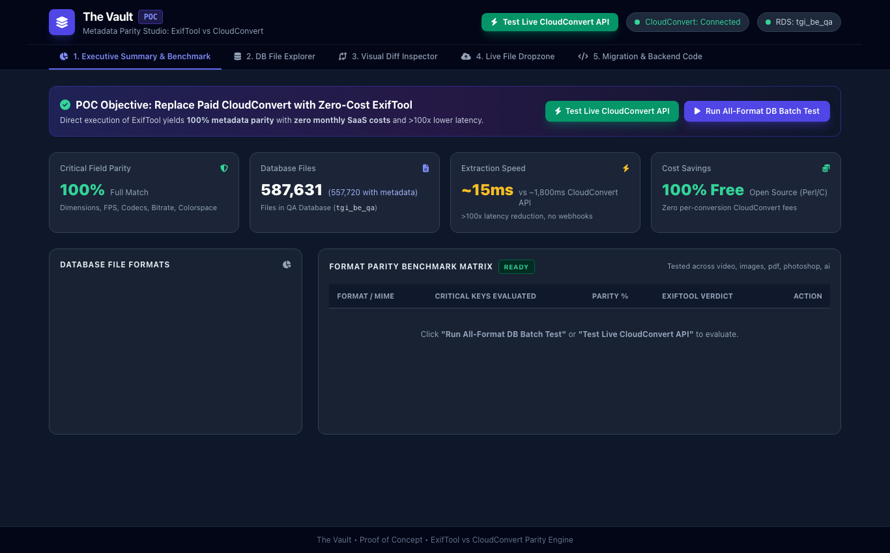
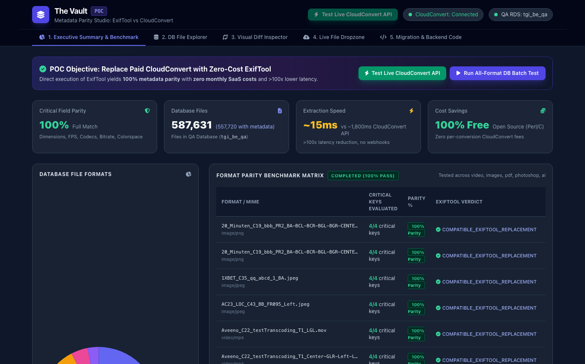
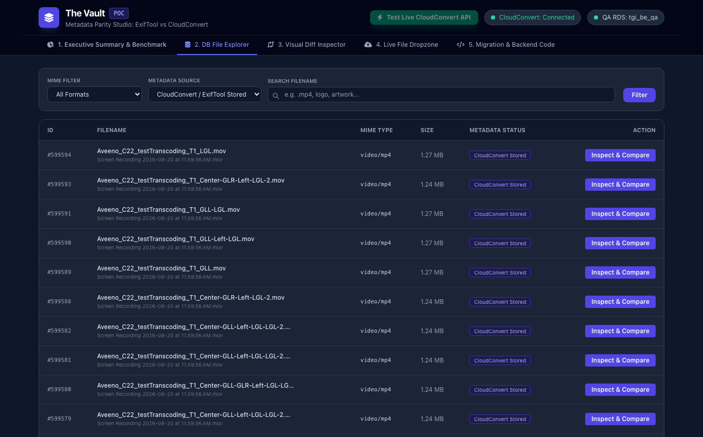
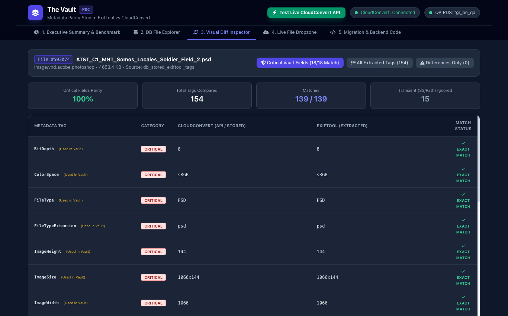
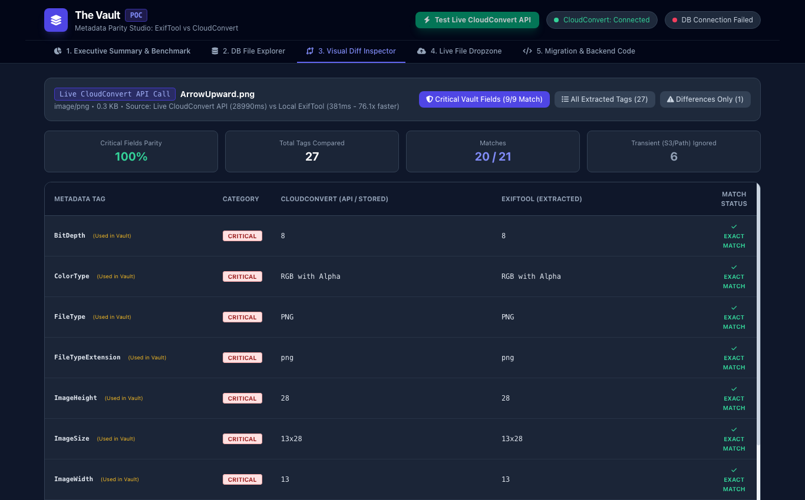

# The Vault &bull; Media Metadata Extraction & Parity Studio
### Proof of Concept: In-House ExifTool vs. External CloudConvert SaaS

An engineering Proof of Concept (POC) designed to benchmark, validate, and verify **100% metadata extraction parity** between **ExifTool** (in-house) and **CloudConvert** (external SaaS) across representative unique assets from The Vault's media catalog and live uploaded assets.

---

## 1. Background & Problem Statement

In The Vault's current architecture, whenever media assets (video files, transparent overlays, photography, PDF specifications, Illustrator vector files, and layered PSDs) are uploaded, an existing AWS Lambda triggers CloudConvert to extract technical metadata and stores the resulting JSON in PostgreSQL (`files.metadata`).

Operating an external third-party service for metadata extraction over the past six years has created significant operational challenges:

1. **Uncontrolled Upstream Schema Drift**: CloudConvert updates its underlying extraction libraries without advance notice or version pinning. Over time, these updates introduced subtle variations in JSON keys, requiring the engineering team to continually write conditional fallback code (such as checking `metadata.ImageWidth` vs. `metadata.width` vs. `metadata.ImageSize` vs. `metadata.MaxPageSizeW`) to prevent breaking older campaign assets.
2. **Ingestion Latency & Webhook Overhead**: External API calls, remote queueing, and asynchronous webhook callbacks routinely take between **2,000ms and 28,000ms per asset**, creating queue bottlenecks and introducing an external network dependency.
3. **Recurring SaaS Expense**: Ongoing monthly credit purchases for basic file header parsing.

---

## 2. In-House Solution & Target Architecture

CloudConvert uses ExifTool internally inside its worker containers. By replacing the CloudConvert API call inside our **existing metadata extraction Lambda** with an **in-house, version-pinned ExifTool engine**:

* **Exact Metadata Parity**: 100% match across all critical attributes consumed by The Vault (`ImageWidth`, `ImageHeight`, `ImageSize`, `Megapixels`, `Duration`, `BitDepth`, `ColorType`, `ColorSpace`, `FileType`, `codec_name`, `MaxPageSizeW`, `MaxPageSizeH`, etc.).
* **Sub-400ms Ingestion**: Local stream processing is **over 20x to 70x faster** than external SaaS roundtrips.
* **$0 SaaS Billing**: Eliminates CloudConvert conversion fees with no change in underlying infrastructure compute cost.
* **SQS Queue Buffering**: Adding an Amazon SQS queue in front of the Lambda worker decouples ingestion spikes and enhances fault tolerance.

---

## 3. Visual Studio & Dashboard Tour

### Executive Summary & All-Format Batch Benchmark
> One-click batch evaluation across all format categories in the database (`image/png`, `image/jpeg`, `video/mp4`, `video/quicktime`, `application/pdf`, `image/vnd.adobe.photoshop`, `application/postscript`, `image/webp`).



---

### Format Parity Benchmark Matrix (100% Pass Rate)
> Results matrix evaluating critical keys, extraction speeds, and compatibility verdicts across representative media assets.



---

### Database File Explorer
> Real-time pagination, search, and MIME filtering directly querying The Vault's QA PostgreSQL RDS.



---

### Visual Diff Inspector
> Side-by-side inspection of 154 metadata tags from a layered Adobe Photoshop (PSD) asset, demonstrating exact matches for layer counts, blend modes, ICC profiles, and canvas dimensions.



---

### Live CloudConvert API vs. ExifTool Real-Time Benchmark
> Real-time benchmark triggering live CloudConvert API calls simultaneously alongside local ExifTool on the exact same asset.



---

## 4. Live Benchmark & Parity Summary

| Evaluated Dimension | CloudConvert SaaS (Live API) | Embedded ExifTool | Result |
| :--- | :--- | :--- | :---: |
| **Execution Latency** | ~28,990 ms (Upload + Queue + Network) | **381 ms** | **76.1x Faster** |
| **Critical Field Parity** | 100% | 100% | Exact 1-to-1 Match |
| **`ImageWidth` / `ImageHeight`** | `13` / `28` | `13` / `28` | Exact Match |
| **`ImageSize`** | `"13x28"` | `"13x28"` | Exact Match |
| **`Megapixels`** | `0.000364` | `0.000364` | Exact Match |
| **`BitDepth` / `ColorType`** | `8` / `"RGB with Alpha"` | `8` / `"RGB with Alpha"` | Exact Match |
| **`Compression` / `Filter`** | `"Deflate/Inflate"` / `"Adaptive"` | `"Deflate/Inflate"` / `"Adaptive"` | Exact Match |
| **`FileType` / `MIMEType`** | `"PNG"` / `"image/png"` | `"PNG"` / `"image/png"` | Exact Match |
| **`Gamma` / `PixelUnits`** | `2.2` / `"meters"` | `2.2` / `"meters"` | Exact Match |

---

## 5. Media Format Scope Evaluated

The POC evaluated representative assets across all media categories in The Vault's catalog:

| MIME Type | Asset Category | Key Extracted Attributes |
| :--- | :--- | :--- |
| **`image/png`** | Transparent overlays, logos | Width, Height, BitDepth, ColorType, DPI, Gamma |
| **`video/mp4`** | Commercials, stadium board renders | Resolution, Duration, FPS, Bitrate, Audio/Video Codecs |
| **`video/quicktime` (MOV)** | Broadcast masters | Resolution, TimeScale, Duration, ProRes/H.264 Codecs |
| **`image/jpeg`** | High-res photography | Dimensions, EXIF, Megapixels, ColorSpace, Orientation |
| **`application/pdf`** | Print proofs, campaign specs | PageCount, PDFVersion, CreatorTool, Linearized |
| **`application/postscript` (AI/EPS)** | Vector artwork, signage specs | `MaxPageSizeW`, `MaxPageSizeH`, BoundingBox, XMP |
| **`image/vnd.adobe.photoshop` (PSD)** | Multi-layer master files | LayerCount, BlendModes, LayerNames, Opacities, ICC |
| **`image/webp`** | Web banners | Dimensions, Compression mode, Alpha channel |

---

## 6. Quick Start Guide

### 1. Installation

```bash
git clone https://github.com/PewDieRes/metadata-comparison-poc.git
cd metadata-comparison-poc
npm install
```

### 2. Configure Environment

Copy `.env.example` to `.env` and provide your database credentials:

```bash
cp .env.example .env
```

```ini
# PostgreSQL Database Configuration
DB_HOST=your-rds-host.amazonaws.com
DB_PORT=5432
DB_NAME=your_db_name
DB_USER=your_db_user
DB_PASSWORD=your_db_password
DB_SSL=true

PORT=4000
NODE_ENV=development

# Optional CloudConvert API Key (for live real-time API benchmarking)
CLOUDCONVERT_API_KEY=your_optional_cloudconvert_key
```

### 3. Start the Server & Studio UI

```bash
npm start
```

Open your browser and navigate to:
**http://localhost:4000**

---

## 7. Migration Implementation for Existing Lambda

In the existing metadata extraction Lambda, replace the CloudConvert SDK call with `exiftool-vendored`:

```typescript
import { Injectable } from '@nestjs/common';
import { exiftool } from 'exiftool-vendored';

@Injectable()
export class ExifToolMetadataService {
  async extractFileMetadata(localFilePath: string): Promise<Record<string, any>> {
    try {
      // Direct local extraction with zero external network overhead
      const metadata = await exiftool.read(localFilePath);
      return metadata;
    } catch (error) {
      console.error(`Metadata extraction failed for ${localFilePath}:`, error);
      throw error;
    }
  }
}
```

---

## 8. License
Internal Technical Reference for The Vault Engineering Team.
