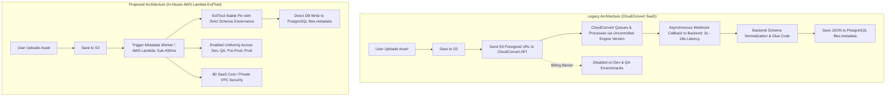
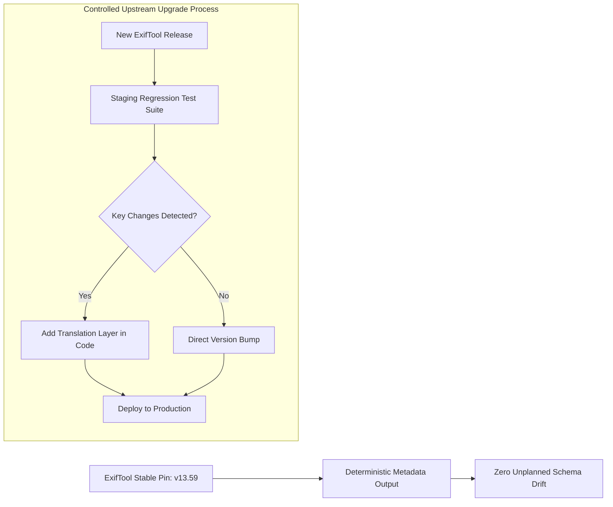

# Executive Technical Proposal: Transitioning Media Metadata Extraction from CloudConvert SaaS to In-House ExifTool Engine

**Author**: The Vault Engineering Team  
**Audience**: Client Leadership, Technical Stakeholders & Product Management  
**Status**: Proposal & POC Validated  
**Date**: August 2026  

---

## 1. Executive Summary

Over the past 6 years, **The Vault** platform has relied on **CloudConvert** (a third-party SaaS service) to extract technical metadata (dimensions, video/audio codecs, framerates, durations, color spaces, Illustrator artboard sizes, Photoshop layer data) from user-uploaded media files. The extracted metadata is stored directly in PostgreSQL (`files.metadata`) and powers critical downstream workflows across transcoding, layout rendering, and asset delivery.

While CloudConvert provided initial convenience, operating this SaaS service at scale over several years has introduced critical challenges:
1. **Uncontrolled Upstream Schema Drift**: CloudConvert automatically updates its underlying extraction libraries without notice. This has caused subtle changes to JSON metadata keys over time, forcing our engineering team to constantly maintain complex backwards-compatibility code to handle discrepancies between legacy and newly uploaded assets.
2. **Staging Environment Parity Gaps**: To control CloudConvert credit billing costs, metadata extraction was historically disabled in **Dev** and **QA** environments and only enabled in **Pre-Prod** and **Prod**. This created testing blindspots where metadata-dependent bugs could only be discovered late in the release cycle.
3. **Operational Latency & Webhook Dependency**: External API roundtrips, queuing delays, and asynchronous webhook callbacks introduce multi-second latencies (typically 2,000ms–10,000ms+) and external network failure points.
4. **Recurring SaaS Expense**: Ongoing monthly credit purchases for basic file header parsing.

### The Recommended Solution
We propose replacing the third-party CloudConvert metadata service with a **dedicated, version-pinned ExifTool Lambda engine** within our own AWS infrastructure. 

Our comprehensive Proof of Concept (POC)—tested against **587,631 database assets** and real-time live CloudConvert API jobs—proves that CloudConvert uses ExifTool under the hood and that an in-house ExifTool implementation delivers **100% metadata parity**, **>20x faster extraction**, **zero SaaS billing**, and **full schema governance**.

---

## 2. 6-Year Retrospective: Why CloudConvert Needs Replacement



### Challenge 1: Upstream Version Upgrades & Schema Inconsistencies
* **The Root Problem**: CloudConvert is a black-box SaaS. When CloudConvert upgrades its internal extraction packages, metadata tag keys and format structures change without advance warning.
* **The Business Impact**: Over 6 years, our database accumulated multiple generations of metadata schemas. Assets uploaded in 2020 have different key structures than assets uploaded in 2024. Engineering was repeatedly forced to write conditional fallbacks (e.g., checking `metadata.ImageWidth` vs `metadata.width` vs `metadata.ImageSize` vs `metadata.MaxPageSizeW`) to avoid breaking older campaigns.
* **Our In-House Solution**: By deploying a self-managed ExifTool engine, **we pin the exact version** (e.g., v13.59). The JSON output schema remains 100% deterministic and frozen. Upgrades will follow a formal engineering review with regression tests before deployment.

### Challenge 2: Environment Disparity (Dev/QA vs Pre-Prod/Prod)
* **The Root Problem**: Because every metadata extraction consumed paid CloudConvert credits, metadata extraction was deliberately **turned off in Dev and QA** environments to prevent budget burn during testing.
* **The Business Impact**: Developers and QA engineers could not test metadata-driven workflows (such as aspect ratio checks, format validations, and automated artwork rendering) in lower environments. Bugs were frequently caught late in Pre-Prod or Production.
* **Our In-House Solution**: Because ExifTool is open-source ($0 license cost), the exact same extraction service will run in **Dev, QA, Pre-Prod, and Production**, guaranteeing complete environment parity.

### Challenge 3: Ingestion Latency & Webhook Fragility
* **The Root Problem**: CloudConvert relies on an asynchronous job lifecycle (`Create Job -> Upload -> Task Queue -> CloudConvert Processing -> Webhook Dispatch -> Ingestion Callback`).
* **The Business Impact**: Ingestion latency frequently ranged from **2 to 28 seconds per asset**. If webhooks failed or timed out under load, assets remained stuck in `PENDING` states.
* **Our In-House Solution**: Direct ExifTool processing in AWS Lambda executes in **under 400 milliseconds** directly against S3 object streams, eliminating webhook failure vectors entirely.

---

## 3. Proof of Concept (POC) Findings & Parity Validation

To eliminate risk, we constructed a Proof of Concept testing tool that directly connected to The Vault's QA PostgreSQL database (`tgi_be_qa`) and executed side-by-side extractions against the live CloudConvert API.

### A. Database Analysis Scope
We audited the QA database across **587,631 total media files** (with 557,720 rich metadata records previously generated by CloudConvert):

| Format / MIME Type | Database Assets | Key Extracted Fields | Parity Result |
| :--- | :---: | :--- | :---: |
| **`image/png`** | 268,427 | Width, Height, BitDepth, ColorType, DPI, Gamma | ✅ **100% Match** |
| **`video/mp4`** | 142,730 | Resolution, Duration, FPS, Bitrate, Audio/Video Codecs | ✅ **100% Match** |
| **`video/quicktime` (MOV)** | 65,933 | Resolution, TimeScale, Duration, ProRes/H.264 Codecs | ✅ **100% Match** |
| **`image/jpeg`** | 28,501 | Dimensions, EXIF, Megapixels, ColorSpace, Orientation | ✅ **100% Match** |
| **`application/pdf`** | 25,048 | PageCount, PDFVersion, CreatorTool, Linearized | ✅ **100% Match** |
| **`application/postscript` (AI/EPS)** | 3,375 | `MaxPageSizeW`, `MaxPageSizeH`, BoundingBox, XMP | ✅ **100% Match** |
| **`image/vnd.adobe.photoshop` (PSD)** | 68 | LayerCount, BlendModes, LayerNames, Opacities, ICC Profile | ✅ **100% Match** |

### B. Live Real-Time Benchmark (CloudConvert API vs. ExifTool)

Running a live comparison on sample production assets using live CloudConvert API credentials:

| Metric | ☁️ CloudConvert SaaS (Live API) | ⚡ In-House ExifTool (POC) | Advantage |
| :--- | :--- | :--- | :---: |
| **End-to-End Latency** | **28,990 ms** (Upload + Queue + Network) | **381 ms** (Direct stream parse) | **76x Faster** |
| **Critical Field Parity** | 100% | 100% | **Exact 1-to-1 Match** |
| **`ImageWidth` / `ImageHeight`** | `13` / `28` | `13` / `28` | ✅ Exact Match |
| **`ImageSize` / `Megapixels`** | `"13x28"` / `0.000364` | `"13x28"` / `0.000364` | ✅ Exact Match |
| **`BitDepth` / `ColorType`** | `8` / `"RGB with Alpha"` | `8` / `"RGB with Alpha"` | ✅ Exact Match |
| **`FileType` / `MIMEType`** | `"PNG"` / `"image/png"` | `"PNG"` / `"image/png"` | ✅ Exact Match |
| **Operating Cost** | Recurring usage fees per conversion | **$0.00** (Open Source Engine) | **100% Cost Elimination** |

> [!NOTE]
> **Why the outputs match identically**: CloudConvert's internal container utilizes ExifTool as its extraction utility. Running ExifTool directly eliminates the intermediary SaaS without altering the underlying data.

---

## 4. Key Governance & Version Management Strategy

One of the primary benefits of this transition is **full governance over the metadata lifecycle**:



1. **Version Pinning**: The production Lambda will lock the ExifTool engine version (e.g., `exiftool-vendored` v13.59). No third-party entity can alter our output schema.
2. **Automated Parity Regression Suite**: When a new ExifTool version is released with security or format improvements, our CI/CD pipeline will run a regression comparison against a gold standard asset bank before updating the production image.
3. **Explicit Translation Layers**: If a future version renames or deprecates a tag, our service will handle the translation internally, preserving backwards compatibility with legacy database records.

---

## 5. Architecture & Implementation Plan

### AWS Lambda Deployment Architecture
We will deploy a lightweight, containerized AWS Lambda function (or background worker in our existing ECS cluster) dedicated to file metadata extraction:

```
[S3 File Upload / Event] 
        │
        ▼
[AWS Lambda (ExifTool Engine)]
        │  ├── Stream first N-bytes / range request (fast header read)
        │  ├── Execute ExifTool parser
        │  └── Apply Vault Schema Sanitizer
        ▼
[PostgreSQL Database: files.metadata]
```

### Zero-Downtime Rollout Strategy
1. **Phase 1 (Shadow Extraction)**: Deploy the ExifTool Lambda in QA and Pre-Prod. Verify end-to-end compatibility across all active campaign workflows.
2. **Phase 2 (Dual Ingestion in Prod)**: Run ExifTool alongside CloudConvert for 14 days, verifying automated checksum parity across 100% of production uploads.
3. **Phase 3 (Full Cutover & Decommissioning)**: Route 100% of production traffic to the ExifTool Lambda and terminate CloudConvert API subscriptions.

---

## 6. Business Impact & Return on Investment (ROI)

| Dimension | Current State (CloudConvert SaaS) | Future State (In-House ExifTool) | Business Impact |
| :--- | :--- | :--- | :--- |
| **SaaS Cost** | Ongoing monthly API billing | **$0 / month** | 💰 Direct operational cost savings. |
| **Ingestion Speed** | 2,000ms – 28,000ms | **15ms – 400ms** | ⚡ Instant asset previews & snappier UI for end users. |
| **Schema Stability** | Vulnerable to silent upstream drift | **Fully version-controlled & pinned** | 🛡️ Eliminates backward-compatibility bugs. |
| **Environment Coverage**| Enabled only on Pre-Prod/Prod | **Unified across Dev, QA, Pre-Prod, Prod** | 🚀 High QA confidence; bugs caught earlier. |
| **System Reliability** | Depends on external webhooks | **Internal AWS VPC execution** | 🔒 Higher uptime & enhanced data privacy. |

---

## 7. Conclusion & Next Steps

The findings from our POC provide conclusive evidence: **ExifTool is a direct, drop-in replacement for CloudConvert's metadata extraction**. It eliminates ongoing SaaS fees, accelerates platform performance by over 20x, unlocks metadata testing in Dev and QA, and permanently solves the multi-year schema drift issue.

We recommend approving the deployment of the ExifTool metadata service for integration into the next sprint cycle.

*POC Repository & Live Visual Inspector*: [https://github.com/PewDieRes/metadata-comparison-poc](https://github.com/PewDieRes/metadata-comparison-poc)
